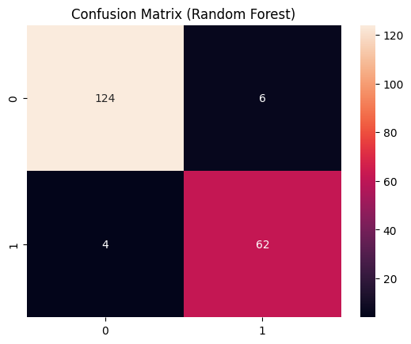
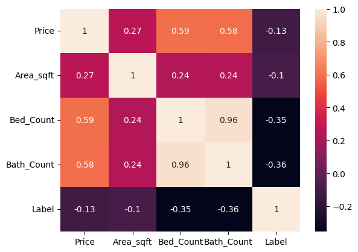
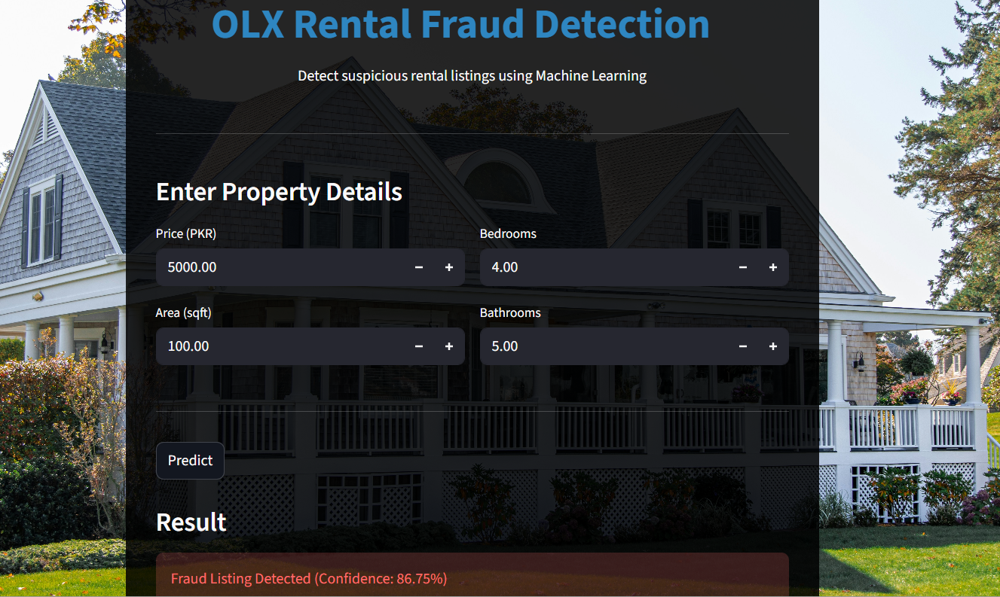

# OLX Rental Fraud Detection System

Machine Learning-based classification system that detects fraudulent rental listings on OLX Pakistan using structured listing data, deployed as a real-time **Streamlit** web application.


---

## Overview

Online rental platforms like OLX Pakistan are increasingly targeted by fraudulent listings that mislead users and cause financial and time losses. Manual detection is unreliable and doesn't scale. This project builds a supervised machine learning pipeline that classifies rental listings as **fraudulent** or **legitimate** using structured numerical features extracted from listing data — price, area, bedroom count and bathroom count — and deploys the final model as an interactive web app.

---

## Problem Statement

Most existing fraud-detection approaches for online marketplaces rely on text or image analysis. In structured listing data, however, signals like price-per-sqft ratios, bedroom-to-bathroom ratios and abnormally low prices relative to area can be strong indicators of fraud. This project trains a supervised classifier on labeled, real OLX listings to flag suspicious listings automatically at the point of submission.

---

## Key Features

- End-to-end ML pipeline: data scraping → cleaning → labeling → feature engineering → model training → evaluation → deployment
- Comparison of three classification models (Logistic Regression, Decision Tree, Random Forest)
- Feature correlation and error analysis to explain model behavior
- Final model deployed as a real-time, user-facing **Streamlit** app
- Achieves **94.90% accuracy** and **92.54% F1-score** on the held-out test set

---

## Dataset

The dataset consists of **970 labeled rental listings** scraped from OLX Pakistan.

| Label | Samples | Percentage |
|---|---|---|
| Legitimate (0) | 650 | 67% |
| Fraudulent (1) | 320 | 33% |

**Features used:**
- `Price` (PKR)
- `Area_sqft`
- `Bed_Count`
- `Bath_Count`

**Preprocessing steps:**
1. Feature selection (the four columns above)
2. Data consistency checks — fixing data types and removing missing values
3. Stratified 80/20 train-test split to preserve class balance
4. `StandardScaler` applied to normalize numeric feature ranges

---

## Models & Results

Three models were trained and evaluated on the same held-out test set:

| Model | Accuracy | Precision | Recall | F1-Score |
|---|---|---|---|---|
| Logistic Regression | 78.06% | 66.20% | 71.21% | 68.61% |
| Decision Tree | 92.35% | 84.93% | 93.94% | 89.21% |
| **Random Forest**  | **94.90%** | **91.18%** | **93.94%** | **92.54%** |

**Random Forest** was selected as the final model — it matched the Decision Tree's recall while achieving substantially higher precision, meaning fewer legitimate listings were wrongly flagged as fraud.

### Confusion Matrix — Random Forest



| | Predicted: Legitimate | Predicted: Fraud |
|---|---|---|
| **Actual: Legitimate** | 124 (TN) | 6 (FP) |
| **Actual: Fraud** | 4 (FN) | 62 (TP) |

- 62 of 66 fraudulent listings correctly detected (high recall)
- Only 4 fraud cases missed (false negatives)
- Only 6 legitimate listings wrongly flagged (false positives)

### Feature Insights

| Feature | Correlation with Fraud Label | Observation |
|---|---|---|
| Price | -0.13 | Slight: lower price → more fraud |
| Area (sqft) | -0.10 | Weak negative |
| Bed Count | -0.35 | Moderate: more beds → less fraud |
| Bath Count | -0.36 | Moderate: more baths → less fraud |

`Bed_Count` and `Bath_Count` are highly correlated with each other (0.96), indicating some redundancy between the two features.

---

## Error Analysis

Out of 196 test samples, the Random Forest model misclassified 10 listings (5.10% error rate):

| Error Type | Count | % of Errors |
|---|---|---|
| False Negatives (missed fraud) | 4 | 40% |
| False Positives (wrongly flagged) | 6 | 60% |

- **False negatives** tended to involve fraud listings with atypically high prices or large areas, which made them resemble legitimate listings.
- **False positives** tended to involve legitimate listings with unusually low price-to-area ratios, which overlapped with typical fraud patterns.

This highlights that price and area features overlap between classes at the margins — additional signals (location, listing description text) could help resolve this ambiguity in future iterations.



---

## Tech Stack

- **Language:** Python
- **ML/Data:** scikit-learn, pandas, NumPy
- **Visualization:** Matplotlib, Seaborn
- **Deployment:** Streamlit
- **Model Persistence:** Pickle (`model.pkl`, `scaler.pkl`)

---

## Project Structure

```
OLX-Rental-Fraud-Detection/
├── app.py                       # Streamlit web application
├── data_scraped.ipynb           # Notebook: scraping raw listings from OLX
├── data_cleaned.ipynb           # Notebook: cleaning & preprocessing
├── model_and_application.ipynb  # Notebook: model training, evaluation & export
├── model.pkl                    # Trained Random Forest model
├── scaler.pkl                   # Fitted StandardScaler
├── urls_backup.pkl              # Backup of scraped listing URLs
├── OLXdata_full1.csv            # Raw scraped dataset
├── OLXdata_labelled.csv         # Final labeled dataset used for training
└── image/                       # App screenshots / assets
```

---

## App Preview

The deployed app takes property details as input (price, area, bedrooms, bathrooms) and returns an instant prediction with a confidence score — e.g., a sample listing was flagged as fraudulent with **86.75% confidence**.



---

## Future Work

- Incorporate NLP features from listing titles and descriptions
- Add location-based features
- Explore gradient-boosted models (XGBoost, LightGBM) on larger datasets
- Address class overlap at price/area boundaries with additional engineered features

---

## Contact

For questions, collaborations, or issues:
- **Email**: hamnaa.waseem@gmail.com
- **LinkedIn**: [https://www.linkedin.com/in/hamna-waseem-2326122ab]

---

**If you find this project useful, please consider giving it a star!**